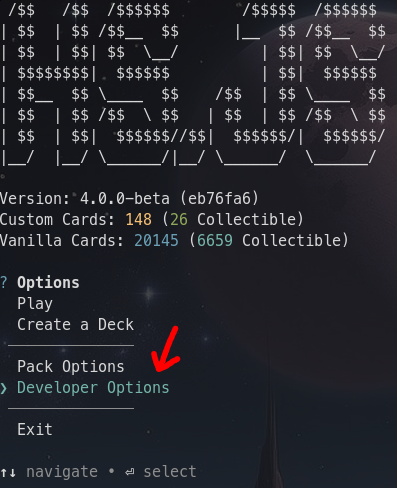
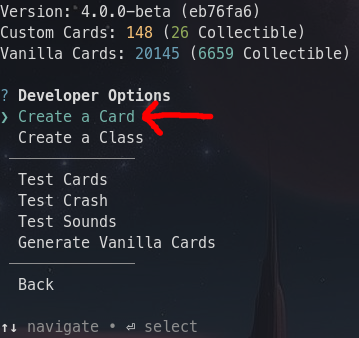
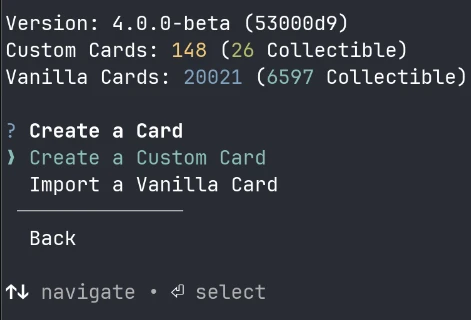

import { Steps } from '@astrojs/starlight/components';

This is the generator you'll likely use the most. It allows you to create a custom card, with no restrictions.

## Running
To run the custom card creator, do the following steps:

<Steps>

1. From the HUB, select `Developer Options`:

2. Then select `Create a Card`:

3. Then select `Create a Custom Card`:

</Steps>

This will take you to a screen that looks like this:

> Sorry for the low resolution.

## Configuring the Card
You can now change any aspect of the card.

### Type
First, you should change its **type**. This reflects the type of the card.
This can be `Minion`, `Spell`, `Weapon`, etc... It affects the way the game should handle the card.
If you're familiar with Hearthstone, you should know the drill.

### Name
Next up is the name. Take a look at [this guide](../../ids/) to see more information about names.
For now, just know that they can be anything and are non-unique.

### Text
After that is the text. This should explain the card and how it works.
Use [color tags](../../color-tags/) to style the text.

### Cost
TODO

### Classes
TODO

### Rarities
TODO

### Collectible
TODO

### Tags
TODO

### Type-Specific
TODO

#### Durability
TODO

#### Cooldown
TODO

#### Enchantment Priority
TODO

### Keywords
TODO

### Runes
TODO
