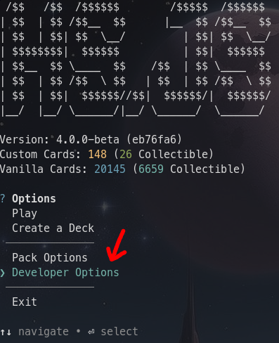
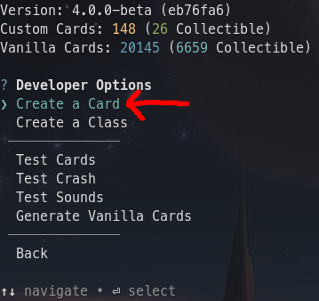
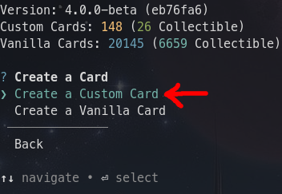
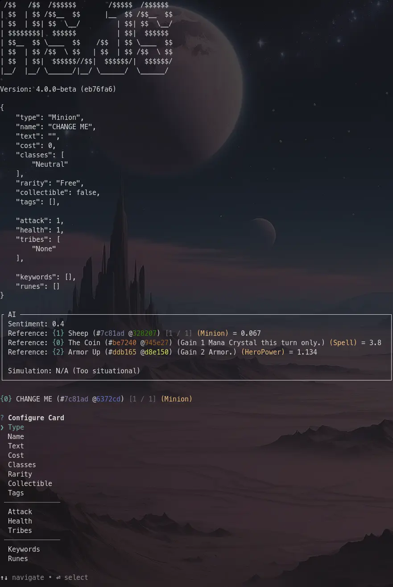
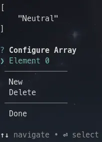
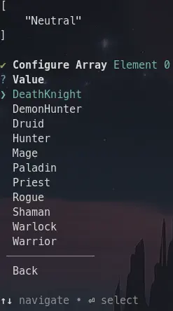

{/* TODO: Remove when it no longer applies. */}
:::caution
This page is a work-in-progress.
Any information on this page may not be accurate.
:::

import { Steps } from '@astrojs/starlight/components';

This is the generator you'll likely use the most. It allows you to create a custom card.

## Running
To run the custom card creator, do the following steps:

<Steps>

1. From the HUB, select `Developer Options`:

2. Then select `Create a Card`:

3. Then select `Create a Custom Card`:

</Steps>

This will take you to a screen that looks like this:

## Configuring the Card
You can now change any aspect of the card.

### Type
First, you should change the card's **type**.
This can be `Minion`, `Spell`, `Weapon`, etc... It affects the way the game should handle the card.
If you're familiar with Hearthstone, you should know the drill.

### Name
Next up is the name. Take a look at [this guide](../../ids/) to see more information about names.
Basically, they can be anything and are non-unique.

### Text
After that is the text. This should explain the card and how it works. Be careful not to overexplain. You should find a good balance.
Use [color tags](../../color-tags/) to style the text.

E.g. `Your <b>Battlecries</b> trigger twice.`

### Cost
This is how much mana the card costs.

### Classes
This is the classes the card belongs to. A card belonging to the `Druid` class can't be added to the deck of a `Mage` when creating a deck, for example.

#### Array Customizer
When setting the classes you'll see a screen like this:

This is the 'Array Customizer'. You might see this in other places.

Choosing `Element 0` allows you to change the first item in the list.

Choosing `New` allows you to add a new item (class) to the list. \
Choosing `Delete` removes the last element from the list.

### Rarity
The rarity of the card. This doesn't really do much by itself, other than color the card's name.

### Collectible
If the card should be collectible. If true, the card can be added to decks.
If this is false, the game won't add the card to any lists unless explicitly asked to include uncollectible cards.

### Tags
Tags add some information to the card. This is used by the game and can be used by cards. The game / cards can easily get all cards with a specific tag. Like classes, this uses the [Array Customizer.](#array-customizer)

- StartingHero - Marks the hero as a starting hero associated with its class.
- Galakrond - Marks the hero as a galakrond hero associated with its class.
- Totem - Marks the card as a 'Basic Totem' card. Cards with this tag can be summoned by the [Shaman's starting hero's hero power](https://hearthstone.wiki.gg/wiki/Totemic_Call).
- Lackey - Marks the card as a lackey card. This is used by the [Rogue Galakrond's hero power](https://hearthstone.wiki.gg/wiki/Galakrond%27s_Guile).
- DIY - Marks the card as a DIY card. These cards have a chance to be added to your hand every turn. [(Configurable)](/guides/game/settings)
- Quest - Marks the card as a 'True Quest'. These cards will drawn from your deck at the start of the game.

### Type-Specific
The following only show up depending on the type of card you're making.

#### Attack
TODO

#### Health
TODO

#### Tribes
TODO

#### Spell Schools
TODO

#### Armor
TODO

#### Durability
TODO

#### Cooldown
TODO

#### Enchantment Priority
TODO

### Keywords
TODO

### Runes
TODO
