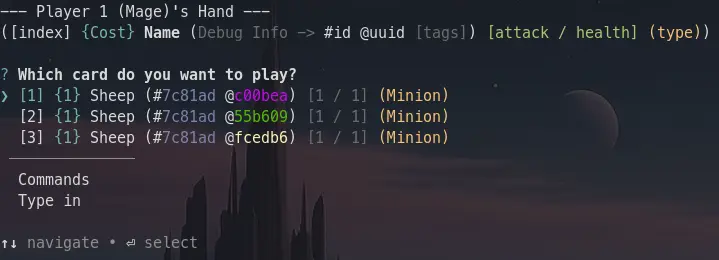

The differences between ids, uuids, and names of cards is something I expect would be confusing, so I will try my best to explain.

## Names
Names are the easiest to explain. They can be anything, and are non-unique.

The name of a card can be access through `card.name`.

## IDs
IDs need to be unique **per blueprint**. This means that every instance of the Sheep card as defined by the blueprint in the `cards/sheep-668b9054.ts` file needs to share the same id:
`019bc665-4f7f-7002-8cd4-7c81ad4e65c6`.

You can see in this picture that the 3 Sheep share the same id. (`#7c81ad`) \

IDs use `uuidv7`, which is formatted like [this](https://uuidv7.org/#uuidInput).

The id of a card can be access through `card.id`.

## UUIDs
UUIDs need to be unique **per card**. Every card *needs* to have a different uuid.

You can see this in this picture that the 3 Sheep have unique uuids. (`@2f92eb`, `@c10b95`, `@7cf0aa`) \

UUIDs use `uuidv7`, which is formatted like [this](https://uuidv7.org/#uuidInput).

The uuid of a card can be access through `card.uuid`.
