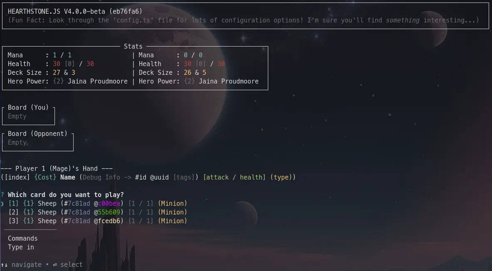
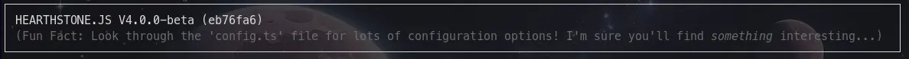
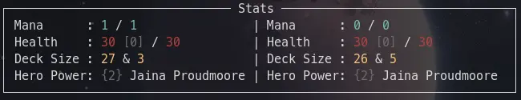
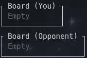
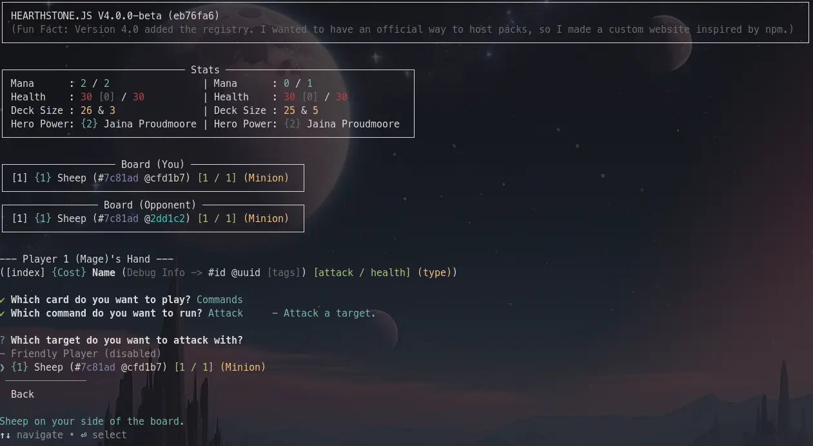
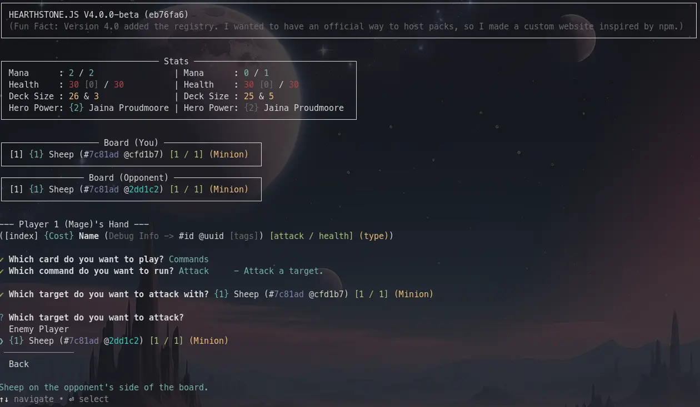
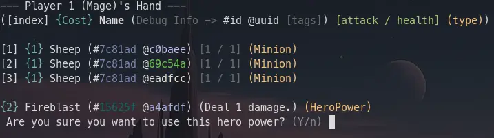
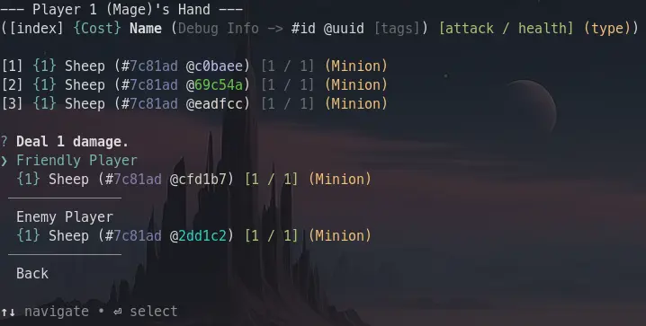

import { Kbd } from 'starlight-kbd/components';

This guide expects you to know the rules of Hearthstone. You can find that [here](https://hearthstone.wiki.gg/wiki/Gameplay).

## Game State
If you've followed the previous guide, you should be seeing a screen like this: \

This might look overwhelming, but let's just take this step-by-step.

### Watermark

This shows some information about Hearthstone.js. \
It shows the version: 4.0.0-beta,\
The commit hash: d9370ca (used to identify the *exact* version of the game), \
And a random fun fact. [(Can be disabled)](../settings/)

### Stats

After the watermark is the "stats". This shows information about the **players**.

The left side of the **"|"** is **your** stats, the right side is the **opponent's** stats.

Here it says that you have 1/1 Mana (Current Mana Crystals / Empty Mana Crystals), while the opponent has 0/0. \
On the next line, it says that you have 30 / 30 Health, and 0 Armor. \
On the next line, it says that you have **27** cards in your deck, and **3** cards in your hand. \
On the next line, it shows your Hero Power, that being "Jaina Proudmoore"'s hero power that costs **2** mana to use.

### Board

Here it shows you and your opponent's board. Any cards played will show up here.

### Hand

The first line says which player you are (Player 1), and your class (Mage). \
The second line shows how to read cards. First the index, then cost, then name, then [id and uuid](../../creating/cards/ids/), and tags, then attack and health, then type.
The cards don't *always* show like this, but it should be a good reference.

It then shows you the cards in your hand after the **"Which card do you want to play?"** prompt.

## Interaction

Now for the juicy part.

You can play a card from your hand by using the ↑/↓ arrows to navigate to it, then pressing <Kbd windows="Enter" /> to select it.

If you want to do something other than playing a card, select "Commands". This will show something like this: \

> Navigate down to the bottom and select "Back" to go back to the previous screen.

These commands are explained in great detail [here](../commands/), but for now, I will just explain the three you will use the most.

### Attack

When you select attack, you'll be prompted to select a friendly target to attack with. You can only select valid targets. The friendly player doesn't have any attack, so it can't attack.

If you select "Back" at any point it will cancel the attack without consequence.

This "select a target" prompt shows up a lot throughout the game, but it *should* be intuitive enough to understand.

It will now ask you to select a target to attack. Here I can select either the enemy player, or the sheep on their side of the board.

### End
If you select end, it will end your turn. By default, you will play against an AI, which will complete its turn very quickly.
**It might look like nothing happened, but it did.** Pay attention to your stats and the board.

### Hero Power

If you select Hero Power, it will ask you if you're sure.

If you select "Y", it will ask you to select a target. Since it says "Deal 1 damage." instead of "Deal 1 damage to an enemy target.", it allows you to select any target.

:::tip
Press <Kbd windows="e" /> on your keyboard to navigate to the enemy secion, and <Kbd windows="f" /> to navigate to the friendly section.
:::
