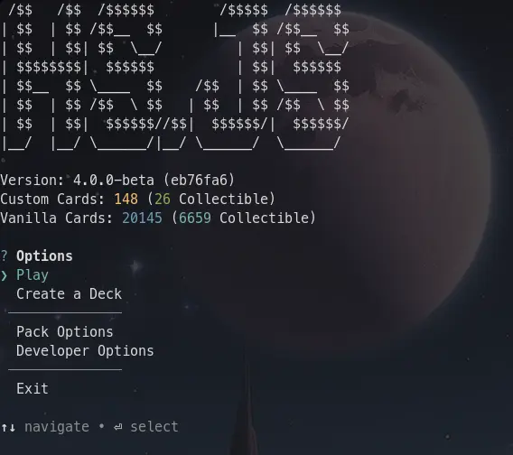
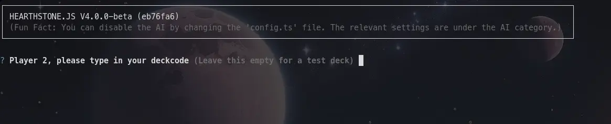
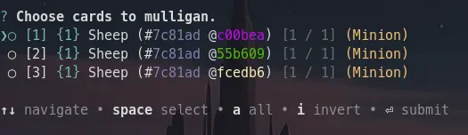

import { Kbd } from 'starlight-kbd/components';

I've tried my best to make playing Hearthstone.js as intuitive as possible, but as the developer, I can't accurately judge how successful I've been.

So if you need this guide, great! That means it was worth making.

## HUB
When you first start Hearthstone.js, you will see a screen that looks like this:

> Ignore if the Vanilla Cards say something different. That won't be relevant just yet.

This is called the HUB. It is what links the different parts of Hearthstone.js together. \
Use the ↑/↓ arrows to navigate, and <Kbd windows="Enter" /> to select.

For right now, you can ignore the other options, and just press Play.

## Deckcode Selection
This will take you to a screen that looks like this:

You can look at the `decks.json` file for a list of pregenerated deckcodes.
If you have [Debug Mode](../settings) on, you can just leave this empty to get a test deck.

Afterwards, it will ask the other player to type in a deckcode.

## Mulligan
Now it'll take you to a screen that might look overwhelming. We'll deal with it piece-by-piece soon, but for now, focus on this part:

Here you can choose which cards you want to [mulligan](https://hearthstone.wiki.gg/wiki/Mulligan). Use the listed keys at the bottom of the screenshot to navigate.

Press <Kbd windows="Space" /> to select cards, and <Kbd windows="Enter" /> to confirm your selection.

## Next Steps
The game is now ready to be played. Head on over to the next guide to learn how to properly play.