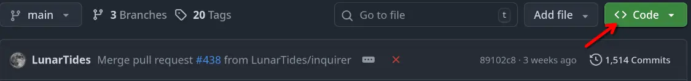
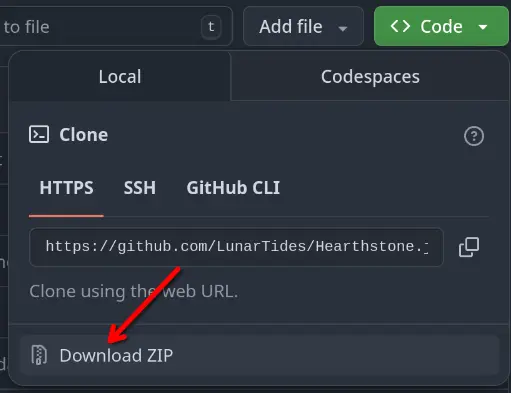

import { Steps, Tabs, TabItem } from '@astrojs/starlight/components';
import { Kbd } from 'starlight-kbd/components';

## Prerequisites
In order to install Hearthstone.js, you need a few prerequisite things installed.

- [Bun](https://bun.sh) - This is the JavaScript runtime required to run the game.
- [Docker](https://docker.com/) (Optional) - This is *only* required to host production versions of the registry or docs.

## Downloading
Now that you've installed the prerequisites, it's time to download the game. There are 2 different ways you can do this.

### Use Git
> **Pros:** Makes updating easier. \
> **Cons:** More complicated.

<Steps>

1. Install [Git](https://git-scm.com).

2.
    <Tabs>
        <TabItem label="Windows">Hit <Kbd windows="Win+R" />, then type `cmd` and hit enter.</TabItem>
        <TabItem label="Linux">Open your terminal of choice.</TabItem>
    </Tabs>

3. Navigate to the folder you want to download Hearthstone.js to:
    ```bash
    cd Downloads
    ```
4. Clone the Hearthstone.js repository:
    ```bash
    git clone https://github.com/LunarTides/Hearthstone.js
    ```
5. Navigate to the newly created folder:
    ```bash
    cd Hearthstone.js
    ```

</Steps>

### Download manually
> **Pros:** Easier. \
> **Cons:** Makes updating a nightmare.

<Steps>

1. Press the `Code` button on the Hearthstone.js GitHub page:

2. Press the `Download ZIP` button:

3. Extract the ZIP file wherever.

</Steps>

## Running
Now that you have the Hearthstone.js folder on your system, it's time to run it.

There are 2 ways to do this.

### Terminal (Recommended)
> **Pros:** If Hearthstone.js crashes, you can see the error message. \
> **Cons:** More complicated.

<Steps>

1. 
    <Tabs>
        <TabItem label="Windows">Hit <Kbd windows="Win+R" />, then type `cmd` and hit enter.</TabItem>
        <TabItem label="Linux">Open your terminal of choice.</TabItem>
    </Tabs>
2. Navigate to your Hearthstone.js folder using `cd`. For example, if you placed the folder in your downloads, run:
    ```bash
    cd Downloads/Hearthstone.js
    ```
3. Install the games' dependencies:
    ```bash
    bun install
    ```
4. Start the game:
    ```bash
    bun .
    ```

</Steps>

### Start Files (Windows Exclusive)
> **Pros:** Easier. \
> **Cons:** If Hearthstone.js crashes, it can be hard to tell what happened.

<Steps>

1. Double-click the `setup.bat` file.
2. Double-click the `run.bat` file.

</Steps>

## Troubleshooting
TODO