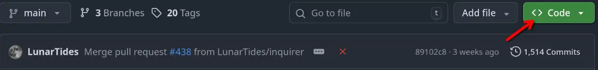
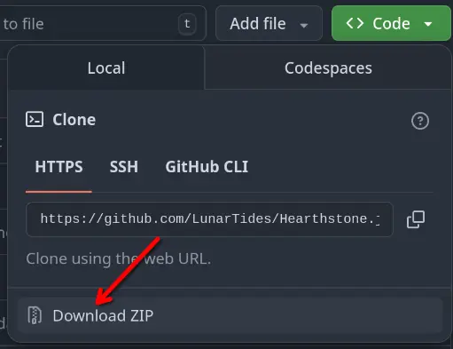

import { Steps, Tabs, TabItem } from '@astrojs/starlight/components';
import { Kbd } from 'starlight-kbd/components';

## Prerequisites
In order to install Hearthstone.js, you need a few prerequisite things installed.

- [Bun](https://bun.sh) - This is the JavaScript runtime required to run the game.
- [Node.js](https://nodejs.org) - This other JavaScript runtime is required by a dependency.
- [Docker](https://docker.com) (Optional) - This is *only* required to host the registry, or the production version of the docs.
- [Git](https://git-scm.com) (Optional) - Optional way to download the project.

## Downloading
Now that you've installed the prerequisites, it's time to download the game. There are 2 different ways you can do this.

### Use Git
> **Pros:** Makes updating easier. \
> **Cons:** More complicated.

<Steps>

1. Install [Git](https://git-scm.com).

2.
    <Tabs>
        <TabItem label="Windows">Hit <Kbd windows="Win+R" />, then type `cmd` and hit enter.</TabItem>
        <TabItem label="Linux">Open your terminal of choice.</TabItem>
    </Tabs>

3. Navigate to the folder you want to download Hearthstone.js to:
    ```bash
    cd Downloads
    ```
4. Clone the Hearthstone.js repository:
    ```bash
    git clone https://github.com/LunarTides/Hearthstone.js
    ```
5. Navigate to the newly created folder:
    ```bash
    cd Hearthstone.js
    ```

</Steps>

### Download manually
> **Pros:** Easier. \
> **Cons:** Makes updating a nightmare.

Before doing this, have a look at the [instructions for updating a manual installation.](#updating-a-manual-installation). Only continue if you're okay with this.

<Steps>

1. Press the `Code` button on the Hearthstone.js GitHub page:

2. Press the `Download ZIP` button:

3. Extract the ZIP file wherever.

</Steps>

## Running
Now that you have the Hearthstone.js folder on your system, it's time to run it.

There are 2 ways to do this.

### Terminal (Recommended)
> **Pros:** If Hearthstone.js crashes, you can see the error message. \
> **Cons:** More complicated.

<Steps>

1. 
    <Tabs>
        <TabItem label="Windows">Hit <Kbd windows="Win+R" />, then type `cmd` and hit enter.</TabItem>
        <TabItem label="Linux">Open your terminal of choice.</TabItem>
    </Tabs>
2. Navigate to your Hearthstone.js folder using `cd`. For example, if you placed the folder in your downloads, run:
    ```bash
    cd Downloads/Hearthstone.js
    ```
3. Install the games' dependencies:
    ```bash
    bun install
    ```
4. Start the game:
    ```bash
    bun .
    ```

</Steps>

### Start Files (Windows Exclusive)
> **Pros:** Easier. \
> **Cons:** If Hearthstone.js crashes, it can be hard to tell what happened.

<Steps>

1. Double-click the `setup.bat` file.
2. Double-click the `run.bat` file.

</Steps>

## Updating
The way to update the game is different depending on how you downloaded it.

### Updating using Git
If you downloaded the game using git, updating is (relatively) easy.

<Steps>

1. 
    <Tabs>
        <TabItem label="Windows">Hit <Kbd windows="Win+R" />, then type `cmd` and hit enter.</TabItem>
        <TabItem label="Linux">Open your terminal of choice.</TabItem>
    </Tabs>
2. Navigate to your Hearthstone.js folder using `cd`. For example, if you placed the folder in your downloads, run:
    ```bash
    cd Downloads/Hearthstone.js
    ```
3. Pull the latest changes using git:
    ```bash
   git pull
    ```

    If this fails, see [troubleshooting.](#troubleshooting)

</Steps>

### Updating a manual installation
If you downloaded the game manually, you have to download the zip file again, and repeat the rest of the download steps. You will lose your changes to the configuration file, and any cards you've downloaded or made unless you know how to carry them over. I suggest just downloading the project using git.

## Troubleshooting
TODO
