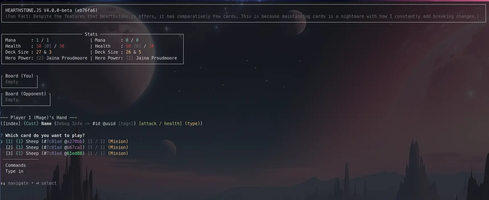

import { Card, CardGrid, Image } from '@astrojs/starlight/components';

## Play Hearthstone in your terminal

Hearthstone.js is a recreation of [Hearthstone made by Blizzard.](https://hearthstone.wiki.gg/wiki/Hearthstone)

It is played entirely in your terminal.

### Features
- Most of Hearthstone's features before 2025!
- Create your own cards. Minimal programming knowledge required!
- Limitations on what cards can do are considered bugs!
- Make your own decks.
- A relatively clean codebase which is easy to mod!
- 70+ configurable settings to change how the game works!
- An AI (or two) you can play against!
- Import cards directly from Hearthstone!
- Procedural audio support!
- ~150 pre-built cards. (26 Collectible.)
- Publish cards online for others to see and use!
- GPL-3.0 License.

<CardGrid>
	<Card title="Create cards" icon="add-document">
	    Make your own cards!
	</Card>
	<Card title="Play against your computer" icon="laptop">
	    Your computer will decide what moves to play on your opponent's turn.
	</Card>
	<Card title="Mod the game" icon="pen">
	    Extend the game with a easily customizable codebase.
	</Card>
	<Card title="Configuration" icon="setting">
    Configure the game to your liking!
	</Card>
	<Card title="Download cards online" icon="download">
	  Download and upload cards to the [registry](/registry).
	</Card>
	<Card title="Read the docs" icon="open-book">
		Learn more by [reading the docs](./guides/introduction).
	</Card>
</CardGrid>
